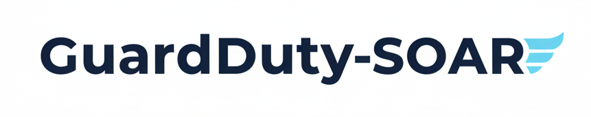

GuardDuty SOAR is a fully serverless, event-driven SOAR (Security Orchestration, Automation, and Response) framework built on AWS. It transforms your AWS security posture from reactive to proactive by providing a robust, extensible, and cost-effective solution to automate the remediation of AWS GuardDuty findings in near real-time.

When GuardDuty detects a potential threat, this framework instantly triggers a customizable Playbook via AWS EventBridge and Lambda. These playbooks execute a sequence of Actions—from tagging and isolating a compromised EC2 instance to blocking malicious IPs—all based on AWS security [recommendations and best practices](https://docs.aws.amazon.com/guardduty/latest/ug/guardduty_finding-types-active.html). The result is a dramatic reduction in incident response time, a minimized blast radius for security events, and a consistent, auditable trail of all actions taken.

## Key Features
This project is built with a focus on modern software architecture, scalability, and testability.
- __Serverless and Cost-Effective__: Built entirely on AWS Lambda, EventBridge, and S3, ensuring you only pay for what you use with zero idle costs and near infinite scalability.
- __Dynamic Playbook Engine__: A powerful, decorator-based registry allows you to add new remediation playbooks for any GuardDuty finding type without modifying the core engine. This makes the framework highly extensible and easy to maintain.
- __Reusable Action Library__: Playbooks are composed of small, single-purpose, and reusable __Actions__ (e.g., IsolateInstance, TagResource, BlockIp). This promotes DRY (Don't Repeat Yourself) principles and simplifies playbook creation.
- __Layered & Decoupled Architecture__: A clean, multi-layered inheritance pattern separates orchestration (Playbooks) from implementation (Actions), making the codebase easy to navigate and test.
- __Comprehensive Testing Suite__: The project includes a multi-layered testing strategy with:
  -  __Unit Tests__: Using botocore.stub to mock the AWS API for fast, isolated testing of individual actions and components.
  -  __Integration Tests__: A dedicated suite that runs against a non-production AWS account to validate real-world interactions with

## Project Roadmap & Status

This project is developed in stages. Here is a high-level overview of our progress.

| Alpha | Beta | Maintenance |
| :--- | :--- | :--- |
| **Tasks:** Playbook and Action Creation | **Tasks:** Refactoring, Live Testing and Bug Fixes | **Tasks:** Issues, Documentation and Enhancements |
| ✅ EC2 Findings | ☐ Code refactoring (where applicable) | ☐ Reported Issues |
| ✅ IAM Findings | ☐ Test refactoring (where applicable) | ☐ Documentation refactoring and updating |
| ☐ S3 Protection Findings | ☐ Live Terraform Testing | ☐ Feature request enhancements |
| ☐ EKS Protection Findings | ☐ Bug Fixes (Continuous) | ☐ Bug Fixes (Continuous) |
| ☐ RDS Protection Findings | ☐ Documentation Rough | |
| ☐ Lambda Protection Findings | ☐ Light Enhancements | |
| ☐ Malware Protection for EC2 Findings | | |
| ☐ Malware Protection for S3 Findings | | |
| ☐ Runtime Monitoring Findings | | |
| ☐ Attack Sequence Findings   | | |

## Documentation

